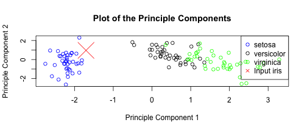

## PreProcessing

Using the preProcess function from the Caret library, we can see that these 4 variables boil down to 2 principle components:


```r
preProc <- preProcess(iris[, -5], method = "pca", thresh = 0.9)
preProc
```

```
## 
## Call:
## preProcess.default(x = iris[, -5], method = "pca", thresh = 0.9)
## 
## Created from 150 samples and 4 variables
## Pre-processing: principal component signal extraction, scaled, centered 
## 
## PCA needed 2 components to capture 90 percent of the variance
```


---

## Model and prediction

It's quick to train a random forest model on a dataset of this size.


```r
intraining <- createDataPartition(iris$Species, p = 0.8, list = FALSE)
train <- iris[intraining, ]
preProc2 <- preProcess(train[, -5], method = "pca", thresh = 0.9)
trainingPCA <- predict(preProc2, train[, -5])
trainingPCA$Species <- train$Species
model <- train(Species ~ ., data = trainingPCA, method = "rf")
test <- iris[-intraining, ]
testingPCA <- predict(preProc2, test[, -5])
predict <- predict(model, testingPCA)
out <- table(predict == test$Species)
```


```
## 
## FALSE  TRUE 
##     4    26
```

---

## Output

So then we can run predictions against values submitted through the iris classification tool:

```r
input <- data.frame(Sepal.Length = 5.2, Sepal.Width = 2.8, Petal.Length = 1.8, 
    Petal.Width = 0.1)
inputPCA <- predict(preProc, input)
predict <- predict(model, inputPCA)
predict
```

```
## [1] setosa
## Levels: setosa versicolor virginica
```



